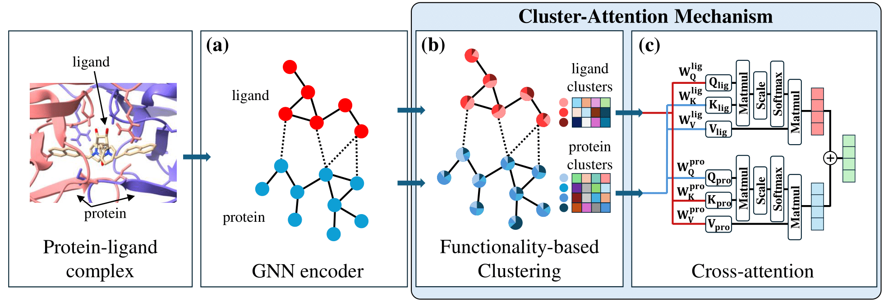

# CheapNet: Cross-attention on Hierarchical representations for Efficient protein-ligand binding Affinity Prediction

This is the official repository for "CheapNet: Cross-attention on Hierarchical representations for Efficient protein-ligand binding Affinity Prediction".

- [Paper](https://hyukjunlim.github.io/figures/CheapNet.pdf)
- [Project Page](https://hyukjunlim.github.io/project/CheapNet.html).

We propose CheapNet, a novel interaction-based model that integrates atom-level representations with hierarchical cluster-level interactions through a cross-attention mechanism. By employing differentiable pooling of atom-level embeddings, CheapNet efficiently captures essential higher-order molecular representations crucial for accurate binding predictions. Extensive evaluations demonstrate that CheapNet not only achieves state-of-the-art performance across multiple binding affinity prediction tasks but also maintains prediction accuracy with reasonable computational efficiency.

## Overview of the Architecture of CheapNet



## Key Contributions of CheapNet

  - We propose a hierarchical model that integrates atom-level and cluster-level interactions, improving the representation of protein-ligand complexes.
  - Our model incorporates a cross-attention mechanism between protein and ligand clusters, focusing on biologically relevant binding interactions.
  - CheapNet achieves state-of-the-art performance across multiple binding affinity prediction tasks while maintaining computational efficiency.

## Key Features

- **Hierarchical Representations**: Higher-level representations to enhance the understanding of protein-ligand interactions that act as groups.
- **Cross-Attention Mechanism**: Leverages cross-attention to capture significant interactions between protein and ligand clusters.
- **Performance**: Achieves high accuracy of protein-ligand binding affinity prediction across various datasets.
- **Efficiency**: Designed to be memory-efficient, requiring minimal memory and computation compared to other attention-based models.

## Dataset

The original dataset can be found at [GIGN](https://github.com/guaguabujianle/GIGN), and [Atom3D](https://github.com/drorlab/atom3d).
Also, you can download the preprocessed dataset at:
- [Cross-dataset Evaluation](https://zenodo.org/records/7490623#.Y60PTnZBxD8)
- [Diverse Protein Evaluation](https://zenodo.org/records/4914718)
- [LEP](https://zenodo.org/records/4914734)


## Installation

To install and use CheapNet, follow these steps:

1. Clone the repository:
   ```bash
   git clone https://github.com/hyukjunlim/CheapNet.git
   cd CheapNet
   ```

2. Set up the environment:
   ```bash
   # For Cross-dataset Evaluation
   conda env create -f cheapcross.yaml
   conda activate cheapcross

   # For Diverse Protein Evaluation (LBA 30%, LBA 60%), and LEP
   conda env create -f cheapdivlep.yaml
   conda activate cheapdivlep
   ```

## Usage

### Training the Model

To train CheapNet for each dataset, use the `train.py` script:

```bash
# For Cross-dataset Evaluation
python train.py

# For Diverse Protein Evaluation
## LBA 30%
python train.py --seqid 30 --num_epochs 15 --learning_rate 1.5e-3 --use_scheduler 0 --data_dir $LMDBDIR

## LBA 60%
python train.py --seqid 60 --learning_rate 1e-3 --data_dir $LMDBDIR 

# For LEP
python train.py --learning_rate 15e-4 --data_dir $LMDBDIR
```

### Prediction

To predict the binding affinity of protein-ligand complexes, use the `predict.py` script:

```bash
# For Cross-dataset Evaluation
python predict.py
python predict_casf.py

# For Diverse Protein Evaluation
## LBA 30%
python predict.py --seqid 30

## LBA 60%
python predict.py --seqid 60

# For LEP
python predict.py
```

### Evaluation

To evaluate the model's performance, use the `evaulate.py` script:

```bash
python evaluate.py
```

## Citation

If the code have been helpful in your research, please cite CheapNet:

```bash
@inproceedings{
lim2025cheapnet,
title={CheapNet: Cross-attention on Hierarchical representations for Efficient protein-ligand binding Affinity Prediction},
author={Hyukjun Lim and Sun Kim and Sangseon Lee},
booktitle={The Thirteenth International Conference on Learning Representations},
year={2025},
url={https://openreview.net/forum?id=A1HhtITVEi}
}
```